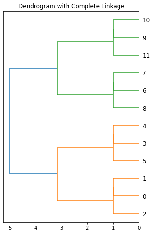

Welcome to PyMinimax’s documentation!
=====================================

.. toctree:: :maxdepth: 1 :caption: Contents:

PyMinimax is a Python implementation of the prototype clustering, or minimax linkage hierarchical clustering, which is a modern and powerful hierarchical clustering method that's not currently available in SciPy. 
We have made its API completely SciPy-compatible. Enjoy using it with SciPy!

Installation
-------

.. code-block:: ipython3

    pip install pyminimax

Usage
-----

.. code-block:: ipython3

    from pyminimax import minimax
    from pandas import DataFrame
    from scipy.spatial.distance import pdist
    
    X = [[0, 0], [0, 1], [1, 0], [0, 4], [0, 3], [1, 4], [4, 0], [3, 0], [4, 1], [4, 4], [3, 4], [4, 3]]
    Z = minimax(pdist(X))
    
    DataFrame(Z)

.. raw:: html

    

    
    <table border="1" class="dataframe">
      <thead>
        <tr style="text-align: right;">
          <th></th>
          <th>0</th>
          <th>1</th>
          <th>2</th>
          <th>3</th>
        </tr>
      </thead>
      <tbody>
        <tr>
          <th>0</th>
          <td>0.0</td>
          <td>1.0</td>
          <td>1.000000</td>
          <td>2.0</td>
        </tr>
        <tr>
          <th>1</th>
          <td>2.0</td>
          <td>12.0</td>
          <td>1.000000</td>
          <td>3.0</td>
        </tr>
        <tr>
          <th>2</th>
          <td>3.0</td>
          <td>4.0</td>
          <td>1.000000</td>
          <td>2.0</td>
        </tr>
        <tr>
          <th>3</th>
          <td>6.0</td>
          <td>7.0</td>
          <td>1.000000</td>
          <td>2.0</td>
        </tr>
        <tr>
          <th>4</th>
          <td>5.0</td>
          <td>14.0</td>
          <td>1.000000</td>
          <td>3.0</td>
        </tr>
        <tr>
          <th>5</th>
          <td>8.0</td>
          <td>15.0</td>
          <td>1.000000</td>
          <td>3.0</td>
        </tr>
        <tr>
          <th>6</th>
          <td>9.0</td>
          <td>10.0</td>
          <td>1.000000</td>
          <td>2.0</td>
        </tr>
        <tr>
          <th>7</th>
          <td>11.0</td>
          <td>18.0</td>
          <td>1.000000</td>
          <td>3.0</td>
        </tr>
        <tr>
          <th>8</th>
          <td>13.0</td>
          <td>16.0</td>
          <td>3.162278</td>
          <td>6.0</td>
        </tr>
        <tr>
          <th>9</th>
          <td>17.0</td>
          <td>19.0</td>
          <td>3.162278</td>
          <td>6.0</td>
        </tr>
        <tr>
          <th>10</th>
          <td>20.0</td>
          <td>21.0</td>
          <td>5.000000</td>
          <td>12.0</td>
        </tr>
      </tbody>
    </table>
    

.. code-block:: ipython3

    from scipy.cluster import hierarchy
    import matplotlib.pyplot as plt
    
    fig, ax = plt.subplots(1, 1, figsize=(5, 8))
    hierarchy.dendrogram(Z, ax=ax, orientation='left')
    ax.set(title='Dendrogram with Complete Linkage')
    plt.show()

See Also
--------

-  `scipy.cluster.hierarchy.linkage <https://docs.scipy.org/doc/scipy/reference/generated/scipy.cluster.hierarchy.linkage.html#scipy.cluster.hierarchy.linkage>`__:
   for advanced creation of hierarchical clusterings.
-  `scipy.spatial.distance.pdist <https://docs.scipy.org/doc/scipy/reference/generated/scipy.spatial.distance.pdist.html>`__:
   pairwise distance metrics
